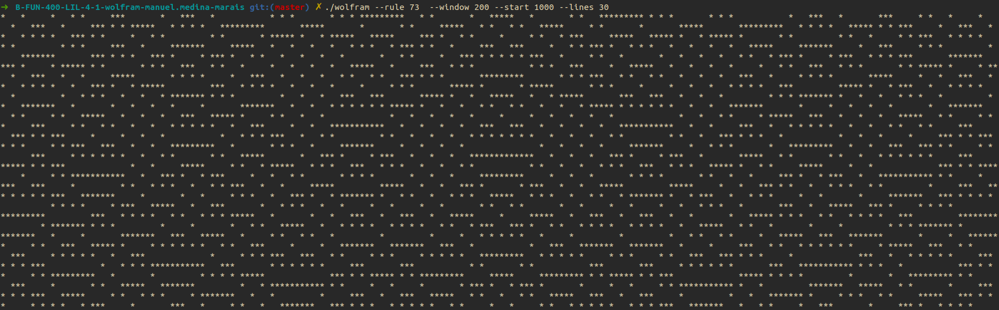
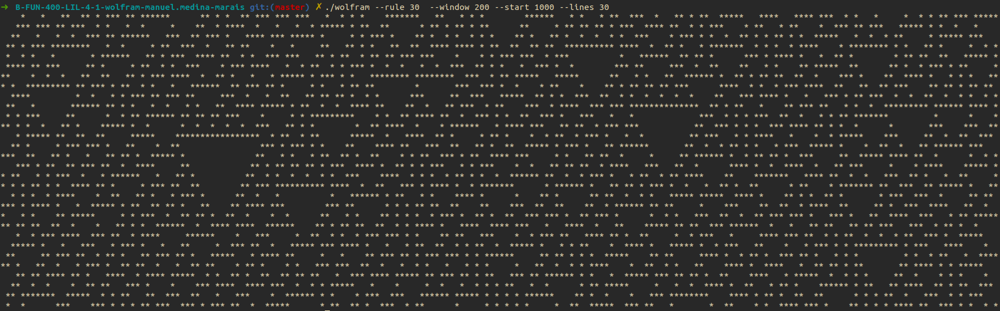

# Wolfram-Elementary-Cellular-Automaton


The goal of this project (made in haskell) is to implement Wolfram's elementary cellular automaton in the terminal. All rules are implemented (from 0 to 255).
## Installation
This project requires ghc to run

Install the dependencies

Ubuntu
```sh
sudo apt-get install haskell-platform
```

Fedora
```sh
sudo dnf install haskell-platform
```

## Building

Build with ghc
```sh
ghc -o wolfram main.hs
```

Build with Makefile
```sh
make
```

## Usage
```sh
./wolfram --rule 90 --lines 20 --start 100 --move -34 --window 200
```

--rule:   the ruleset to use (no default value, mandatory).

--start:  the generation number at which to start the display. The default value is 0.

--lines:  the number of lines to display. When omitted, the program never stops.

--window: the number of cells to display on each line (line width). If even,

 the central cell is displayed in the next cell on the right. The default value is 80.
 
--move:   a translation to apply on the window. If negative, the window is translated to the left.

 If positive, it's translated to the right.

 

 
